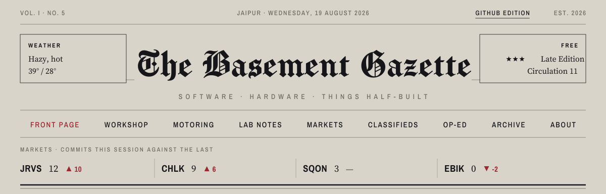
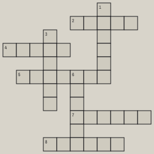

<picture>
  <source media="(prefers-color-scheme: dark)" srcset="assets/masthead-dark.svg">
  
</picture>

<table>
<tr>
<td width="26%" valign="top">

**COLUMN ONE**

### The last version? (Apparently not)

*JAIPUR* — I have written JARVIS three times. Each rewrite began believing I finally understood it, and ended proving I had only understood the one before.

Phase 5 adds a `/quiet` command, on the grounds that an assistant which never shuts up is just a smoke alarm with opinions.

</td>
<td width="46%" valign="top">

**LEAD STORY · SOFTWARE**

# CHALKDUST TEACHES ITSELF TO DRAW

**BY SHIVAM** · STAFF ENGINEER, NIGHT EDITOR, ONLY EMPLOYEE

A model writing Manim code freehand produces animations that overlap and wander off-frame. So it no longer writes the code — it **selects and parameterizes hand-written, layout-safe components** through a validated spec. Audio is measured before anything renders, so every duration comes from real speech.

Science explainers · CS fundamentals · JEE Advanced

</td>
<td width="28%" valign="top">

**INSIDE TODAY**

| | |
|:---|---:|
| Workshop | 6 |
| Lab Notes | 4 |
| Classifieds | 5 |
| Op-Ed | 1 |

**THE CRITIC RECOMMENDS**

Rubberband Man — THE SPINNERS, 1977. Peter Quill music is the best music.

*More at [shvmkpr.in](https://shvmkpr.in) →*

</td>
</tr>
</table>

<table>
<tr>
<td width="58%" valign="top">

### SCHOOL CONTENT ENGINE
WORKSHOP · *Teaching a machine to make 'tasteful' school posters*

It began with one blurry annual-day photo, shot from the third row, half a curtain in frame. Every school has that page. The photos exist; the care doesn't scale. So the engine scales it — posters written as HTML, opened in an invisible browser, screenshotted at 1080×1080.

**[Read the full piece →](https://shvmkpr.in/workshop/school_content/)** · JINJA2 · LLM · PYTHON

</td>
<td width="42%" valign="top">

### CLASSIFIEDS

**LOST** — One 2.5mm hex key. Last seen doing something important.

**PERSONAL** — First-year CSE, LNMIIT Jaipur. Answers to Shivam.

**NOTICES** — Hot Wheels catalogued, photographed, not for sale.

**MISCELLANY** — The filament shelf has begun sorting itself by colour. Nobody here did this.

</td>
</tr>
</table>

<table>
<tr>
<td width="33%" valign="top">

**CROSSWORD NO. 01**

<picture>
  <source media="(prefers-color-scheme: dark)" srcset="assets/crossword-dark.svg">
  
</picture>

</td>
<td width="33%" valign="top">

**ACROSS**

**2.** An AI that does more than chat (5) **4.** The currency of every LLM (5) **5.** An AI that listens instead of speaks (7) **7.** What every chatbot claims to have (6) **8.** Hidden beneath the model (6)

**DOWN**

**1.** Direction with magnitude (6) **3.** Google's AI family (6) **6.** Instructions for a very literal machine (6)

</td>
<td width="34%" valign="top">

**THE CARTOON**

<picture>
  <source media="(prefers-color-scheme: dark)" srcset="assets/cartoon-dark.svg">
  
</picture>

*The artist works in layers now.*

</td>
</tr>
</table>

THE BASEMENT GAZETTE · PRINTED NIGHTLY · NO REFUNDS · [shvmkpr.in](https://shvmkpr.in)
